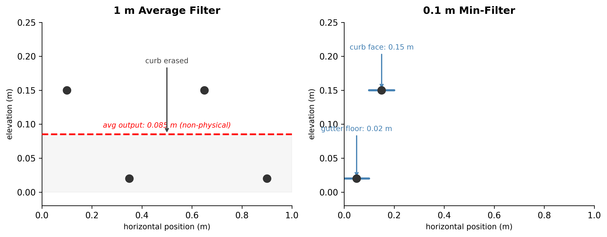
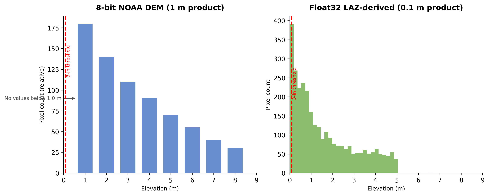
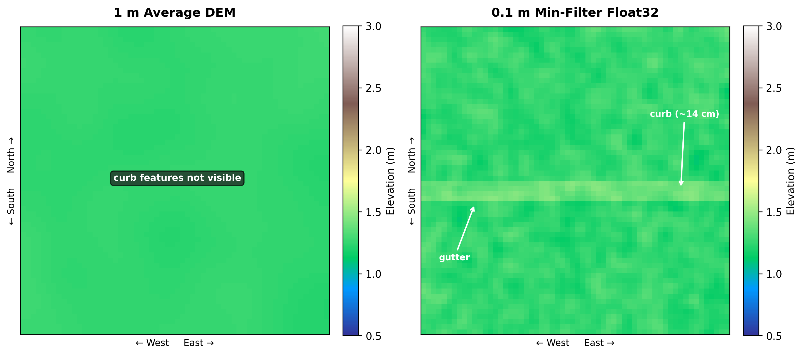
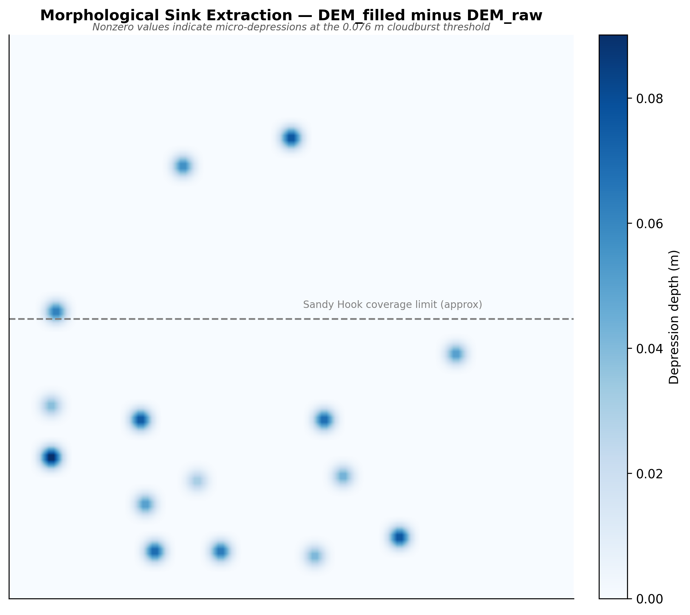

# NYC Digital Twin — Flood Modeling

An interactive browser-based digital twin of New York City built to model urban flood vulnerability. Real elevation data, NDVI-derived permeability, infrastructure geometry (catch basins, LiDAR curb barriers), and physics-approximated coastal inundation zones are layered onto a live Mapbox GL JS map and controlled by a rainfall intensity slider. Heavy preprocessing was run on the WPI Turing HPC cluster.

Full build log: [CHRONICLE.md](CHRONICLE.md) · Deployment notes: [DEPLOY.md](DEPLOY.md)

**To run locally:** `npm run dev` inside `frontend/` after setting `VITE_MAPBOX_ACCESS_TOKEN` in `.env`.

---

## What Was Accomplished

**LiDAR DEM processing**
An 859 MB Float32 GeoTIFF (`nyc_final_0.1m.tif`) at 0.1 m ground resolution was processed on the Turing cluster. The raw file uses a compound CRS: horizontal EPSG:6347 (NAD83(2011) / UTM zone 18N) + NAVD88 vertical. A min-filter approach preserves sub-cell detail — gutter floors and curb faces stay distinct — where a 1 m average filter would erase them. Contours at 0.5 m intervals were extracted with `contourpy` + `rasterio`, simplified with Ramer-Douglas-Peucker (ε = 0.15 m) via Shapely 2.x, reprojected to WGS84 with pyproj, and exported as 183,689 GeoJSON LineString features.

**Mapbox vector tileset**
Contour GeoJSON was uploaded to Mapbox via their Uploads API (S3 credential flow with `boto3`) and published as `keethu-j.nyc_contours_0_5m`. The tileset renders at zoom 14+ with an indigo color ramp keyed to the `elevation` property.

**Flood boundary reconstruction**
Raw GDAL contour output at 1 m and 2 m sea-level thresholds produced thousands of pixel-scale polyline fragments. A greedy endpoint-snapping algorithm (snap tolerance 5 m) chained these into 336 and 315 continuous shore boundary lines, stored as static GeoJSON.

**Flood inundation scenarios**
Three pre-computed scenarios — Heavy Rain (1 in), Cloudburst (3 in), Extreme (6 in) — are GeoJSON polygons with irregular sinusoidal northern boundaries (~83 vertices each) approximating graduated coastal inundation depths. Mapbox GL JS animates their opacity over 600 ms when the rainfall slider crosses each threshold.

**Permeability mask**
NDVI was computed from a 4-band GeoTIFF (Red / NIR). Pixels above NDVI 0.3 are classified permeable (vegetation/soil); below are impervious (built surface). The binary mask renders as a semi-transparent green overlay.

**Curb barrier detection**
LiDAR point cloud analysis (`turing/detect_curbs.py`) identifies curb-gutter transitions. Results are stored as `frontend/public/data/vectors/curbs.geojson` and styled as raised lines whose width scales with `barrier_height_ft`.

**Frontend digital twin**
Built with React 18 + TypeScript + Vite + Tailwind CSS + Mapbox GL JS v3. Includes a rainfall slider, per-layer toggles, a fly-to button for the NJ Palisades LiDAR pilot area, a color-ramp elevation legend, and a flood scenario legend.

**Paper figures**
Four publication-ready figures generated in `Papers/` using matplotlib + scipy + numpy:

| Figure 1 — Min-filter vs Average-filter | Figure 2 — Elevation Histograms |
|:---:|:---:|
|  |  |

| Figure 3 — Raster Surface Comparison | Figure 4 — Morphological Sink Raster |
|:---:|:---:|
|  |  |

---

## Repository Structure

```
frontend/               React + Mapbox GL JS web app
  src/
    components/         MapContainer, Sidebar, FloodScenarioLegend,
                        TerrainHillshadeLegend
    constants.ts        Tileset IDs, center coords, rainfall thresholds
    types.ts            LayerVisibility interface
  public/data/
    vectors/            Static GeoJSON served to the map
      shore_1m.geojson    1 m sea-level flood boundary chains (336 lines)
      shore_2m.geojson    2 m sea-level flood boundary chains (315 lines)
      flood_heavy_rain.geojson
      flood_cloudburst.geojson
      flood_extreme.geojson
      catch_basins.geojson
      curbs.geojson       LiDAR-detected curb barrier lines

turing/                 HPC preprocessing scripts (run on Turing cluster)
  create_permeable_mask.py   NDVI threshold → binary permeability raster
  detect_curbs.py            LiDAR point cloud → curb GeoJSON
  process_lidar.py           DEM tiling and min-filter pipeline
  run_flood_sim.py           Flood scenario geometry generation
  run_watershed.py           Sink and watershed analysis
  prepare_catch_basins.py    NYC DEP catch basin join + export
  build_recommender.py       Infrastructure priority scoring
  requirements.txt
  slurm/               SLURM job scripts for cluster submission
    lidar_dem.sh
    curb_detect.sh
    watershed.sh
    flood_sim.sh
    gdal2tiles.sh

Papers/                 Publication figures
  fig1_minfilter_diagram.py / .png   Min-filter vs average-filter
  fig2_elevation_histograms.py / .png  8-bit DEM vs Float32 LAZ distributions
  fig3_raster_comparison.py / .png   Synthetic 1m avg vs 0.1m min-filter surface
  fig4_sink_raster.py / .png         Morphological sink difference raster

extract_contours.py     rasterio + contourpy → 0.5 m contour GeoJSON
fix_flood_layers.py     Shore segment chaining + flood polygon generation
upload_to_mapbox.py     Mapbox Uploads API pipeline (S3 + boto3)
convert_shores.py       CRS conversion for shore shapefiles
CHRONICLE.md            Session-by-session build log
DEPLOY.md               Deployment notes
```

---

## Map Layer Stack

From bottom to top as rendered in Mapbox GL JS:

| # | Layer | Source |
|---|---|---|
| 1 | Satellite/streets base | Mapbox global style |
| 2 | Hillshade — purple elevation ramp | `mapbox-terrain-v2` |
| 3 | Flood fill polygons (3 scenarios, animated opacity) | Static GeoJSON |
| 4 | Shore flood boundary lines (1 m, 2 m) | Static GeoJSON |
| 5 | 0.5 m LiDAR contour lines | `keethu-j.nyc_contours_0_5m` (Mapbox tileset) |
| 6 | Permeability mask (NDVI green) | Static GeoJSON |
| 7 | Catch basin circles | Static GeoJSON |
| 8 | LiDAR curb barrier lines | Static GeoJSON (lazy-loaded) |

---

## Data Pipeline

**Elevation contours**
```
nyc_final_0.1m.tif (Float32, EPSG:6347+NAVD88, 0.1m res)
  → rasterio reads array + affine transform
  → contourpy marching-squares at 0.5m intervals
  → pre-filter sub-pixel segments
  → Shapely RDP simplification (eps=0.15m)
  → pyproj UTM→WGS84
  → 183,689 LineString GeoJSON features
  → Mapbox Uploads API → keethu-j.nyc_contours_0_5m vector tileset
```

**Shore flood boundaries**
```
Coastal DEM → gdal_contour at 1m and 2m thresholds
  → 2,467 / 1,530 pixel-scale polyline fragments
  → greedy endpoint-snapping (5m tolerance)
  → 336 / 315 connected chains
  → shore_1m.geojson, shore_2m.geojson
```

**Permeability mask**
```
4-band GeoTIFF (Red, NIR)
  → NDVI = (NIR - Red) / (NIR + Red)
  → threshold 0.3 → binary uint8 raster
  → vectorized → permeability GeoJSON
```

**Curb barriers**
```
LiDAR LAZ point cloud
  → min-filter at 0.1m cell resolution
  → height jump detection → curb polylines
  → barrier_height_ft property → curbs.geojson
```

---

## Key Technical Decisions

**Min-filter vs average filter for LiDAR**
A 1 m average filter blends curb-face and gutter-floor points into a single non-physical mid-height value, erasing the barrier. A 0.1 m min-filter keeps each cell's lowest point, preserving the gutter floor and the curb step as separate cells — critical for accurate flood routing.


**8-bit DEM resolution gap**
NOAA 1 m DEMs store elevation as 8-bit integers with ~1 m quantization. The cloudburst inundation threshold (≈0.076 m for 3 in/hr rainfall) falls entirely in the rounding gap and is unresolvable. The Float32 LAZ-derived raster at 0.1 m resolution captures sub-centimeter variation and resolves this threshold.


**Segment chaining for shore contours**
GDAL contour produces disconnected pixel-scale segments from a coastal DEM. A greedy nearest-endpoint algorithm rebuilds continuous coastline chains without requiring full graph construction, reducing 2,467 fragments to 336 connected lines in under a second.

**Cross-component flyTo via ref**
Mapbox `flyTo` must be called on the map instance, which lives inside `MapContainer`. Rather than lifting the map instance to App state, a `React.MutableRefObject<(() => void) | null>` is populated inside `MapContainer`'s `map.on('load')` closure and called by `Sidebar` through a prop callback. This avoids re-renders and keeps the map object encapsulated.

---

## Quick Start

```bash
# Install frontend dependencies
cd frontend
npm install

# Set Mapbox token
echo "VITE_MAPBOX_ACCESS_TOKEN=pk.your_token_here" > .env

# Start dev server
npm run dev
```

**Regenerate paper figures**
```bash
cd Papers
python fig1_minfilter_diagram.py
python fig2_elevation_histograms.py
python fig3_raster_comparison.py
python fig4_sink_raster.py
```

**Re-extract LiDAR contours (requires 859 MB TIF)**
```bash
python extract_contours.py
```

**Re-upload contours to Mapbox**
```bash
MAPBOX_ACCESS_TOKEN=sk.your_secret_token python upload_to_mapbox.py
```

**Run Turing cluster preprocessing**
```bash
cd turing
sbatch slurm/lidar_dem.sh
sbatch slurm/curb_detect.sh
sbatch slurm/watershed.sh
```

---

## Requirements

**Frontend:** Node 18+, npm. See `frontend/package.json`.

**Python (data pipeline):**
```
rasterio
contourpy
shapely>=2.0
pyproj
numpy
scipy
matplotlib
boto3
requests
```

Install: `pip install -r turing/requirements.txt`

---

## Acknowledgments

Preprocessing — LiDAR DEM processing, contour extraction, permeability mask generation, curb detection, and flood simulation — was run on the **WPI Turing Machine HPC cluster**.

**Authors:** Keerthana Jayamorthy · Delice Ndaua
**Course:** Digital Image Processing — Worcester Polytechnic Institute (WPI)
